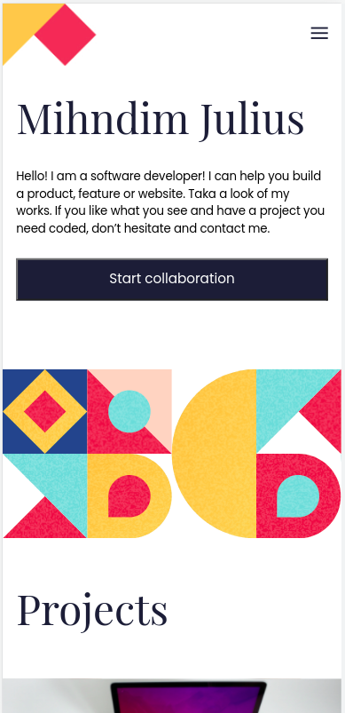

# Mihndim Full-Stack Web-Developer

> This is my portfolio site build using HTML5 and CSS3. Here you will get my personal information, links to projects I have worked on, and a form to leave a message in case you need to contact me. 

## Built With

- HTML5
- CSS3
- VS code

## Live Demo

[Live Demo Link](https://mihndim2020.github.io/Portfolio-Page/)

## Getting Started

To get a local copy up and running follow these simple example steps.

### Prerequisites
- Browser(e.g google chrome, mozilla firefox, safari) and Code editor(e.g VS code)

### Setup
- To run this project locally, go to your terminal(command line), 
- then clone it by entering the command `git clone git@github.com:Mihndim2020/Portfolio-Page.git`,
- then `cd` into the directory `Portfolio-Page`,
- then enter `code .` to open the project in your  `vs code`, 
- then right click on the `html` file and select `start live server`
- the project should display on your browser. 

## Authors

👤 **Mih Julius**

- Github: [@Mihndim2020](https://github.com/Mihndim2020)
- Twitter: [@mihndim](https://github.com/mih-julius)
- Linkedin: [Mih Julius](https://www.linkedin.com/mih-julius)

## 🤝 Contributing

Contributions, issues, and feature requests are welcome!

Feel free to check the [issues page](https://github.com/Mihndim2020/Portfolio-Page/issues).

## Show your support

Give a ⭐️ if you like this project!

## Acknowledgments

- Microverse community

## 📝 License

This project is [MIT](./MIT.md) licensed.
